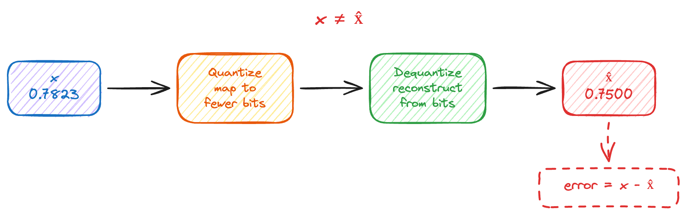
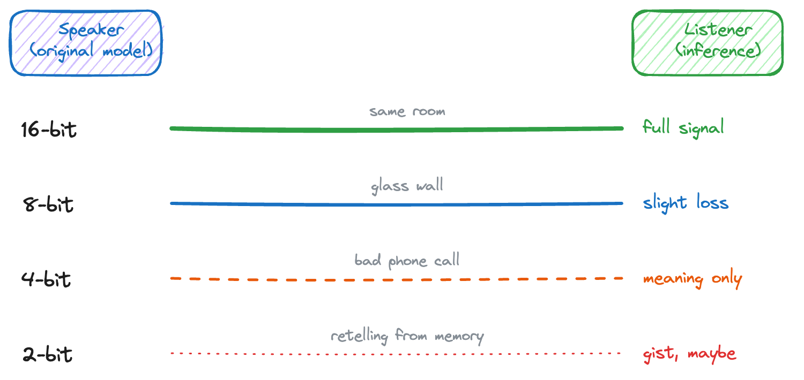
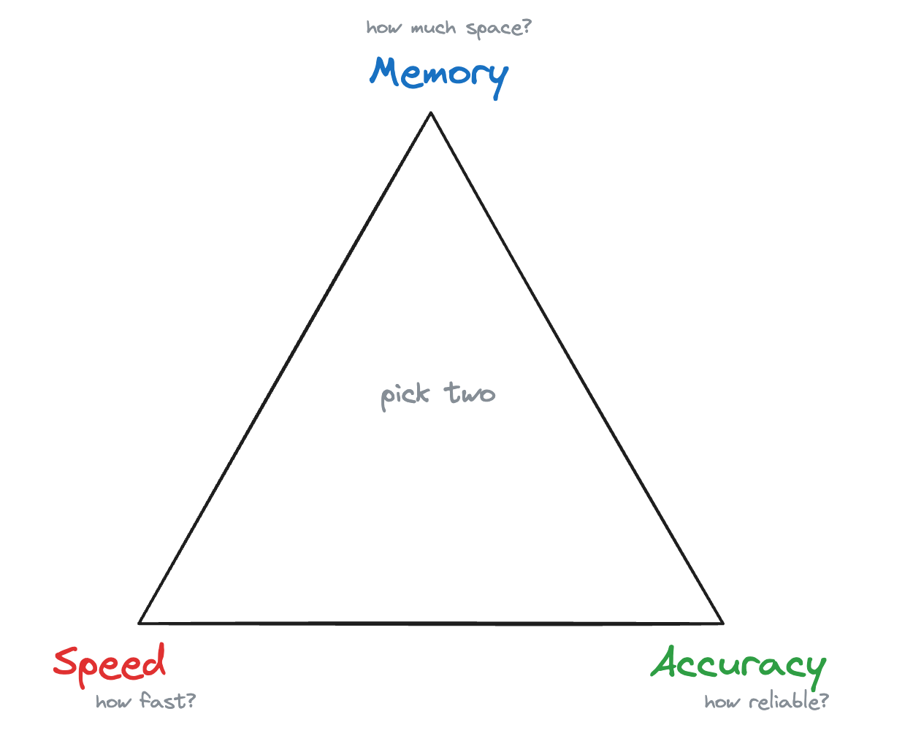

# Intelligence Survives Compression — But Not Unchanged

## A Practical (and Slightly Philosophical) Guide to Quantization

---

Imagine you're listening to someone telling a story. Every word is clear, every detail is sharp. Now imagine the same story, but told through a wall. You still get the plot. You understand the characters. But something is missing — some tone, some subtlety that was there before.

That's quantization.

Not the textbook definition. Not yet. Just the feeling of it. Something that *mostly* survived a transformation — but not entirely.

---

## So What Is Quantization, Really?

Quantization is basically a mapping. You take a large set of possible values and squeeze them into a smaller set. In machine learning, this means taking model weights stored in high-precision floating-point numbers (like 32-bit or 16-bit) and representing them with fewer bits — 8, 4, sometimes even 2.

Why would anyone do this? Because large language models are, well, large. A 70-billion parameter model in 16-bit precision takes roughly 140 GB of memory. That's not fitting on your laptop. It's barely fitting on a single GPU. Quantize that same model to 4 bits, and you're looking at around 35 GB. That changes things.

To see why this matters, remember what a neural network actually does with those weights. At every layer, the math boils down to something like `output = input × weight`. The weight shapes the signal — it decides how much of the input passes through and where it goes next. Quantize that weight, and you're not just changing a number in a file. You're changing the signal that flows through the entire network, layer after layer after layer.

But here's what most tutorials skip: quantization is the easy part. The interesting question is what happens when you try to go back.

---

## The Part Nobody Talks About

Say you have a weight value: `0.7823`. You quantize it to 8 bits. The quantized representation maps to something like `0.7812`. Close. Not exact. But close.

Now try 4 bits. You get `0.75`. Still close, but the gap is growing.

At 2 bits? You might get `1.0`. That's not even the same number anymore.

This process of going back — reconstructing the original value from its quantized form — is called **dequantization**. And here's the equation that should stick with you:

```
x ≠ x̂ = Dequantize(Quantize(x))
```

You start with x. You quantize it. You dequantize it. And what you get back — x̂ — is *not* what you started with.

Quantization looks like a round trip, but it's actually a one-way door.

---

## A Little Math (Just Enough)

The standard uniform quantization formula looks like this:

```
Q(x) = Δ · floor(x / Δ + 0.5)
```

Where Δ (delta) is the step size — the gap between values you can actually represent. Smaller Δ, more precision. Larger Δ, more loss.

When you dequantize, you reconstruct:

```
x̂ = Dequantize(Q(x))
```

And the error is:

```
error = x - x̂
```

That error is small for high bit-widths. It grows as bits decrease. And it's *never* zero (except by luck). That's the price of compression.

---

## Watching It Happen

Let's make this concrete. Here's what the pipeline looks like:



Take a single value — `0.7823` in 16-bit floating point — and see what happens as we quantize it more and more aggressively:

```
Original (FP16)    Quantized Bits    Dequantized Value    Error
0.7823             16 → 8            0.7812               0.0011
0.7823             16 → 4            0.7500               0.0323
0.7823             16 → 2            1.0000              −0.2177
```

Look at that last row. The reconstructed value isn't just wrong — it's a *different* number. The model using this weight isn't making a slightly worse decision. It's making a *different* decision.

Now multiply this by billions of parameters.

---

## The Speaker and the Listener

Think of the original model as a speaker. Full precision — every nuance, every detail. The listener is the inference engine, trying to understand what the speaker means.



At **16-bit precision**, the speaker is in the same room. Clear. No loss.

At **8-bit**, there's a glass wall between them. You can still hear everything, but some details get muffled. You catch the meaning. You miss some nuances.

At **4-bit**, you're on a phone call with bad reception. The main points come through. The subtleties don't. You ask "what?" more than you'd like.

At **2-bit**, someone is summarizing the conversation for you from memory. You get the gist. Maybe.

The real question is not "did the message arrive?" — it's "did the *meaning* survive?"

---

## The Tradeoff Triangle

Every quantization decision sits inside a triangle with three corners:



**Memory** — How much space does the model take? Can it fit on a consumer GPU? A phone? A microcontroller?

**Speed** — Fewer bits means faster math. Integer operations are cheaper than floating-point. Smaller models move through the pipeline faster.

**Accuracy** — How much does the model's behavior change? Are the outputs still reliable? Do edge cases break?

You *can* have all three at their maximum — but the cost in hardware, time, and engineering effort becomes impractical. In practice, you pick two and negotiate with the third. This isn't a limitation of any technique — it's just how information works.

The trick is finding the spot where the model is small enough to be useful, fast enough to be practical, and accurate enough to be trustworthy.

---

## Where Does Quantization Actually Hit?

When people say "quantize a model," they usually mean quantize the weights. But a neural network has more moving parts than that. Quantization can target four different components, each with its own tradeoffs.

### Weights

Weights are the learned parameters of the model — the numbers that define what the network "knows." They're static after training: once the model is done learning, the weights don't change during inference. This makes them the easiest target for quantization.

| | |
|---|---|
| **How common** | Very common. This is what most people mean by "quantized model." |
| **Impact on quality** | Low to moderate. Weights are static and can be calibrated carefully. 8-bit is nearly lossless; 4-bit is usable with modern methods. |
| **Impact on compute/memory** | High. Weights dominate model size. Going from 16-bit to 4-bit cuts storage by 4×. |

### Activations

Activations are the intermediate values that flow through the network as it processes input. Unlike weights, they change with every input — a different prompt produces different activations at every layer. This makes them harder to quantize because their range and distribution shift dynamically.

| | |
|---|---|
| **How common** | Common during training (mixed precision). Less common during inference, but growing with methods like SmoothQuant and LLM.int8(). |
| **Impact on quality** | Moderate to high. Activations often contain outliers — a few channels with values much larger than the rest — that are hard to represent in low bit-widths. Clipping these outliers can degrade output quality significantly. |
| **Impact on compute/memory** | Moderate. Quantizing activations allows integer-only arithmetic (both operands of a matrix multiply are low-precision), which unlocks faster hardware paths. Memory savings are smaller than weights since activations are transient. |

### Gradients

Gradients are the signals that tell the network how to update its weights during training. They only exist during training — inference doesn't compute gradients. Quantizing them is mainly about making distributed training faster by reducing the communication cost between GPUs.

| | |
|---|---|
| **How common** | Rare. Mostly seen in distributed training research and large-scale training runs where communication bandwidth is the bottleneck. |
| **Impact on quality** | High if done carelessly. Gradients are noisy by nature, and aggressive quantization amplifies that noise, which can destabilize training or prevent convergence. Techniques like stochastic rounding help, but the margin is thin. |
| **Impact on compute/memory** | Low for single-GPU setups. High for distributed training — quantized gradients mean less data moving between nodes, which can be the difference between a feasible and infeasible training run. |

### K/V Cache

The key-value cache stores attention keys and values from previous tokens during autoregressive generation. Every time the model generates a new token, it reuses the K/V cache instead of recomputing attention over the entire sequence. The cache grows linearly with sequence length, so for long contexts (32k, 128k tokens), it becomes a serious memory bottleneck — sometimes larger than the model weights themselves.

| | |
|---|---|
| **How common** | Increasingly common. As context windows grow, K/V cache quantization is becoming a practical necessity. Methods like KV-cache quantization to 4-bit or 8-bit are actively deployed. |
| **Impact on quality** | Low to moderate. The cache tolerates quantization surprisingly well — recent work shows 4-bit K/V cache with minimal perplexity increase [1]. Keys tend to be more sensitive than values. |
| **Impact on compute/memory** | High for long sequences. At 128k context length, the K/V cache can use tens of GB. Quantizing it from 16-bit to 4-bit makes long-context inference feasible on hardware that would otherwise run out of memory. |

### The Big Picture

Not all of these are equally mature or equally useful. Here's the landscape at a glance:

```
Component     Typical Use Case        Maturity     Where It Matters Most
─────────     ──────────────────      ────────     ─────────────────────
Weights       Inference, deployment   High         Model size, storage
Activations   Training, inference     Medium       Compute speed
Gradients     Distributed training    Low          Communication bandwidth
K/V Cache     Long-context inference  Growing      Memory during generation
```

---

## Modern Quantization: Not Just Rounding Numbers

If you've been thinking of quantization as "just round the numbers down," modern methods are way more clever than that.

**GPTQ** uses a calibration-based approach. It doesn't just round weights — it adjusts neighboring weights to compensate for the rounding error. Think of it like a group of musicians: if one plays a note slightly flat, the others adjust to keep the chord right. This gives much better quality at 4-bit and even 3-bit precision.

**AWQ** (Activation-Aware Weight Quantization) works from a different angle. It looks at which weights actually matter most for the model's outputs. Not all of them are equally important. AWQ finds the critical channels and protects them, while quantizing the less important ones more aggressively. Keep the muscle, trim the fat.

**GGUF** (and its predecessor GGML) brought quantization to the rest of us. This format and its ecosystem made it practical to run quantized models on CPUs — yes, regular CPUs — with good efficiency. It's basically the reason you can run a 7B parameter model on a MacBook today. The tools around it (llama.cpp and friends) turned quantization from a research topic into something you can actually use day to day.

What they share is the idea that some information matters more than other information, and they optimize for that.

---

## What's Coming Next

There's more to it.

In **Part 2**, we'll open the hood. We'll take the formula apart — piece by piece — and understand what every component does. Then we'll write actual code: quantize a tensor, visualize the error, and see why that error isn't random noise but a structured, repeating pattern. We'll also look at the modern methods that go beyond simple uniform quantization — LLM.int8(), SmoothQuant, AWQ, QLoRA — and why they all share the same underlying philosophy.

Because once you understand the mechanics, the rest of the series hits different.

---

*This is Part 1 of a three-part series on quantization. [Part 2](part2.md) opens the hood on the formula and builds quantization from scratch in code. [Part 3](part3.md) covers deployment strategies, edge AI, and the security surface of compressed models.*

---

## References

*This list is not exhaustive — there are many other sources with ongoing research and examples. Quantization is a fast-moving field, and we're always learning.*

[1] Liu, Z., et al. "KIVI: A Tuning-Free Asymmetric 2bit Quantization for KV Cache." *arXiv preprint arXiv:2402.02750*, 2024. [https://arxiv.org/abs/2402.02750](https://arxiv.org/abs/2402.02750)

[2] DeepLearning.AI. "Quantization In Depth." Short course. [https://www.deeplearning.ai/short-courses/quantization-in-depth/](https://www.deeplearning.ai/short-courses/quantization-in-depth/)

[3] Dettmers, T., et al. "QLoRA: Efficient Finetuning of Quantized LLMs." *arXiv preprint arXiv:2305.14314*, 2023. [https://arxiv.org/abs/2305.14314](https://arxiv.org/abs/2305.14314)

[4] Lee, J., et al. "A Comprehensive Evaluation of Quantized Instruction-Tuned Large Language Models: An Experimental Analysis up to 405B." *arXiv preprint arXiv:2409.11055*, 2024. [https://arxiv.org/abs/2409.11055](https://arxiv.org/abs/2409.11055)

[5] vLLM Project. "Quantization." vLLM Documentation. [https://docs.vllm.ai/en/latest/features/quantization/](https://docs.vllm.ai/en/latest/features/quantization/)
